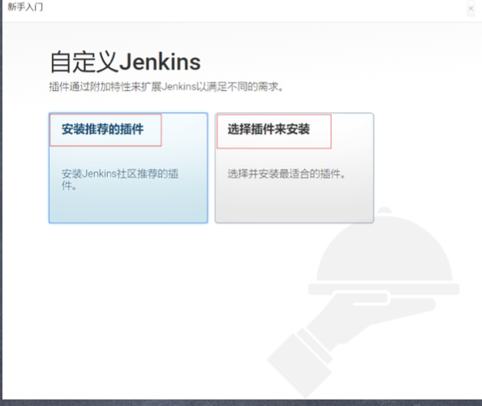
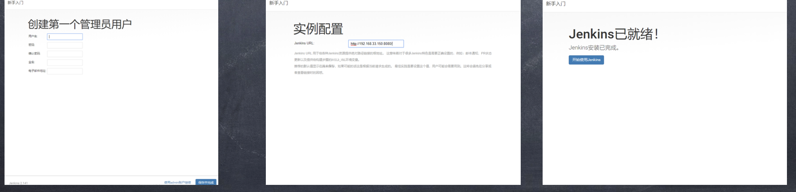
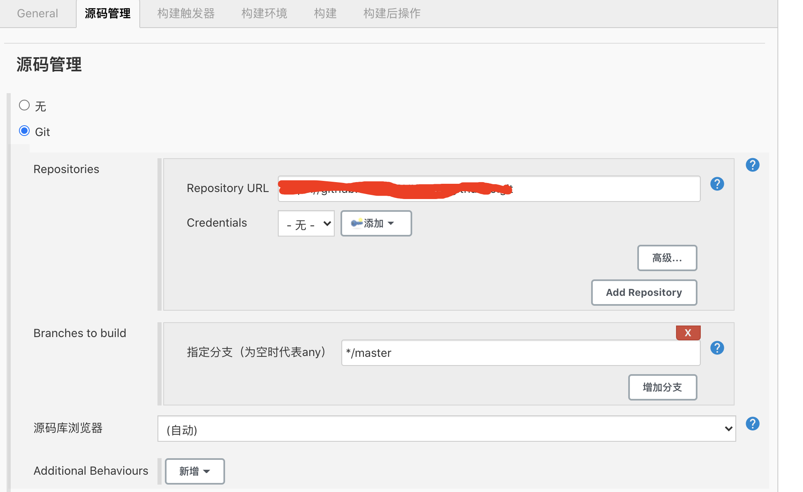
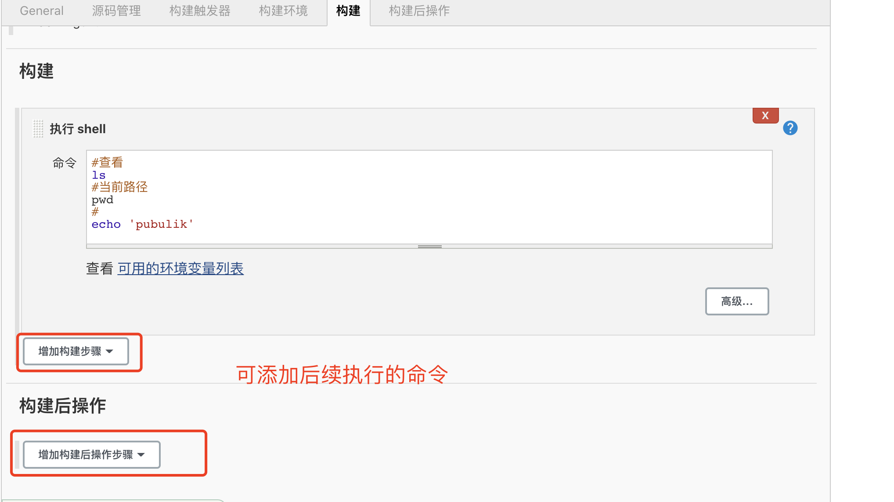

# Jenkins笔记

[Jenkins官网：https://www.jenkins.io/](https://www.jenkins.io/)

## Environmental support

JAVA 8 或者 JAVA  11

## Download and install

长期支持版本 (LTS)。下载安装包，不要下载war格式的。

服务器可下载rpm格式的然后上传。用rpm命令直接解压完成即可。

[下载两种方式可以看这篇文章](https://www.cnblogs.com/djlsunshine/p/10249135.html)


```bash
rpm -ivh jenkin-**.rpm

rpm -qa jenkins
#会输出一个Jenkins**.noarch文件
systemctl start jenkins
#启动Jenkins 打开浏览区访问服务器域名8080端口
#Jenkins安装完成之后是一个服务，不用的时候可以关掉。
```


打开页面后复制 页面展示的路径然后

```shell
cat 复制的路径
#输出一串字符串，复制后粘贴
```

下一步安装插件：欢乐二选一（选择推荐或者自选安装）。两者皆可



下一步顺着点下去就可以



## Pugins

必备插件：

> NodeJS    
> Git PreBuildMerge Trait Plugin   
> GitHub Integration   
> Publish Over SSH    
> SSH Agent

## NewTask

添加git仓库



添加shell



添加完成之后即可去构建

